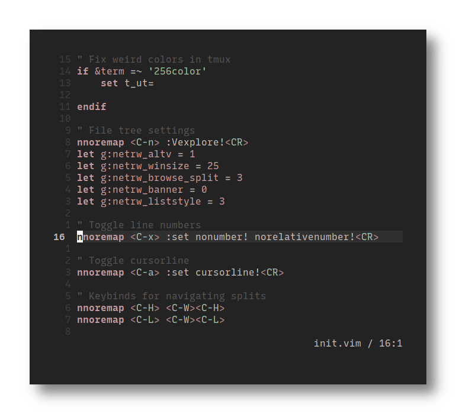
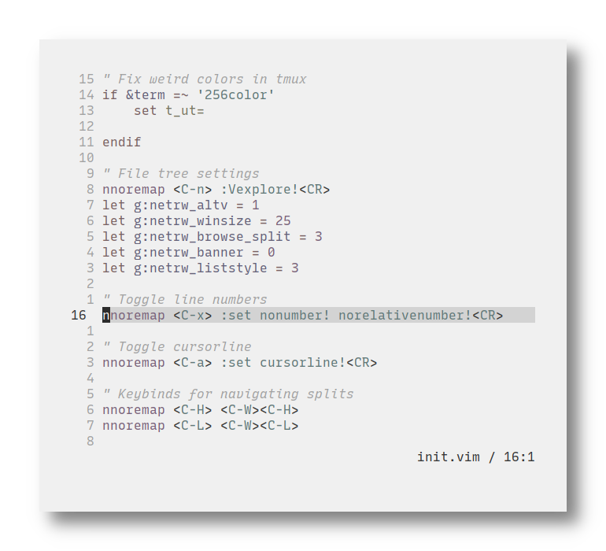

<h1 align="center">Mountaineer.vim</h1>

## Installation

Move `colors/*` into your Vim colors folder, usually `~/.vim/colors` or `~/.config/nvim/colors` and set `colorscheme mountaineer{-grey|light}` in your Vim config.